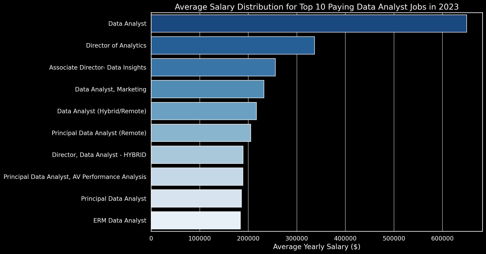
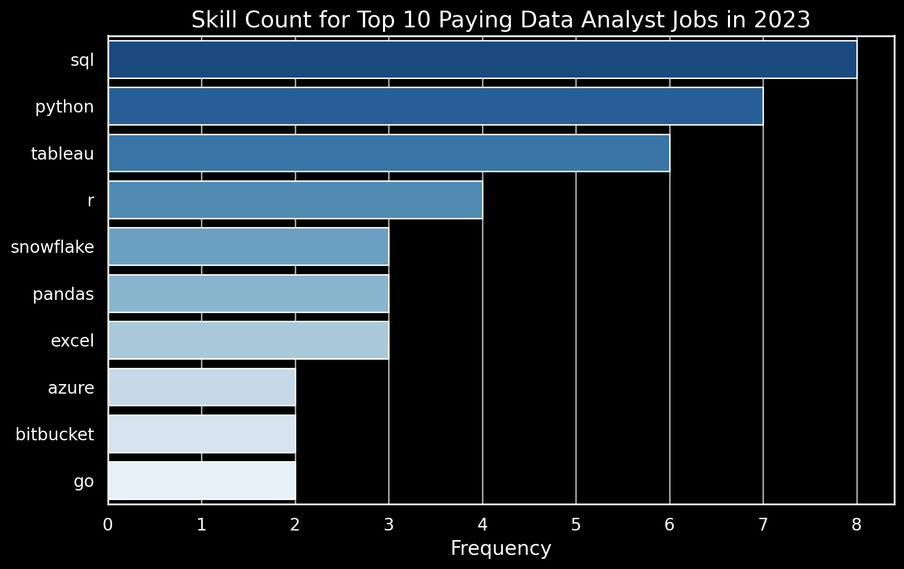
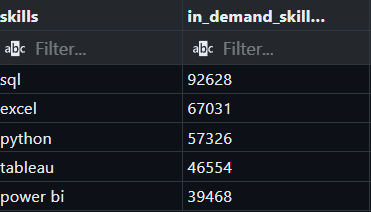
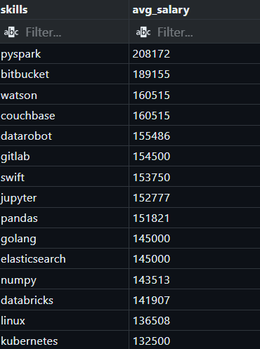
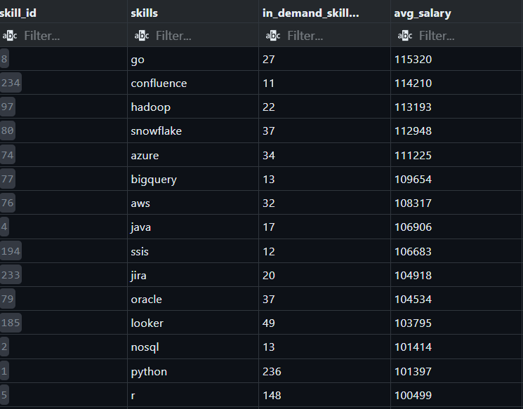

README.md
# Introduction
📊 Dive into the data job market! Focusing on data analyst roles, this project explores 💰 top-paying jobs, 🔥 in-demand skills, and 📈 where high demand meets high salary in data analytics.

This project analyzes Data Analyst job postings using PostgreSQL to uncover:

1) Top-paying roles

2) Required skills for those roles

3) Most in-demand skills

4) Highest-paying skills

5) The most optimal skills (high demand + high salary)

The goal is to translate raw job posting data into actionable career insights using structured SQL.

🔍 SQL queries? Check them out here: [project_sql](/SQL_Project_Data_Job_Analysis/project_sql/)


# Background

The dataset contains job postings and skill mappings across three core tables:

- job_postings_fact – Job-level information (title, salary, location, remote flag)

- skills_job_dim – Bridge table linking jobs to skills

- skills_dim – Skill reference table


The schema follows a classic fact + dimension + bridge structure, modeling a many-to-many relationship between jobs and skills.

# Tools I Used
- PostgreSQL
- VS Code
- Git & GitHub

# The Analysis
Below are the five business questions answered in this project.

## 1️⃣ What are the top-paying Data Analyst jobs? ##

**Objective**

Identify the top 10 highest-paying remote Data Analyst roles with specified salaries and include company names.

**SQL Logic Used**

- LEFT JOIN to include company names

- WHERE to filter Data Analyst + remote + salary not null

- ORDER BY salary_year_avg DESC

- LIMIT 10

**Key Insight**

High-paying remote Data Analyst roles are concentrated among specific companies and specialized roles.

``` sql

SELECT	
	job_id,
    company_dim.name AS name_of_company,
	job_title,
	job_location,
	job_schedule_type,
	salary_year_avg,
	job_posted_date
    
FROM
    job_postings_fact

LEFT JOIN company_dim ON company_dim.company_id = job_postings_fact.company_id 

WHERE
job_title_short = 'Data Analyst' 
-- like this we can search for any role from here..
AND
job_location = 'Anywhere'
AND
salary_year_avg IS NOT NULL
ORDER BY
salary_year_avg DESC
limit 10;
```
Here's the breakdown of the top data analyst jobs in 2023:

- Wide Salary Range: Top 10 paying data analyst roles span from $184,000 to $650,000, indicating significant salary potential in the field.

- Diverse Employers: Companies like SmartAsset, Meta, and AT&T are among those offering high salaries, showing a broad interest across different industries.

- Job Title Variety: There's a high diversity in job titles, from Data Analyst to Director of Analytics, reflecting varied roles and specializations within data analytics.



Bar graph visualizing the salary for the top 10 salaries for data analysts; ChatGPT generated this graph from my SQL query results

## 2️⃣ What skills are required for the top-paying jobs? ## 

**Objective**

Use the top 10 highest-paying jobs and retrieve all associated required skills.

**Important Concept**

- LIMIT must be applied before joining skills.
Otherwise, you limit job-skill rows instead of jobs.

- SQL Structure

- CTE isolates top 10 jobs

- INNER JOIN expands skills per job


**Insight**

- Top-paying jobs often require a combination of:

- SQL

- Advanced analytics tools

- Specialized technical frameworks

- One job can map to multiple skills, expanding into multiple rows after join.

``` sql
WITH top_paying_jobs AS (


SELECT	
	job_id,
    company_dim.name AS name_of_company,
	job_title,
	salary_year_avg

    
FROM
    job_postings_fact

LEFT JOIN company_dim ON company_dim.company_id = job_postings_fact.company_id 

WHERE
job_title_short = 'Data Analyst' 
AND
job_location = 'Anywhere'
AND
salary_year_avg IS NOT NULL
ORDER BY
salary_year_avg DESC
limit 10

)

SELECT 
top_paying_jobs.*, 
skills
FROM
top_paying_jobs 
INNER JOIN skills_job_dim ON top_paying_jobs.job_id = skills_job_dim.job_id
INNER JOIN skills_dim ON skills_job_dim.skill_id = skills_dim.skill_id

```
Here's the breakdown of the most demanded skills for the top 10 highest paying data analyst jobs in 2023:

SQL is leading with a bold count of 8.
Python follows closely with a bold count of 7.
Tableau is also highly sought after, with a bold count of 6. Other skills like R, Snowflake, Pandas, and Excel show varying degrees of demand.



Bar graph visualizing the count of skills for the top 10 paying jobs for data analysts; ChatGPT generated this graph from my SQL query results

## 3️⃣ What are the most in-demand skills? ## 

**Objective**

Identify the top 5 most frequently required skills for Data Analyst roles.

**SQL Techniques Used**

- GROUP BY skills

- COUNT(*)

ORDER BY job_count DESC

**Insight**

- Core tools like SQL, Excel, and Python dominate demand across job postings.

- Demand reflects market stability and hiring frequency.
``` sql
SELECT 
skills,
COUNT(skills_job_dim.job_id) AS in_demand_skills_count
FROM
job_postings_fact
INNER JOIN skills_job_dim ON job_postings_fact.job_id = skills_job_dim.job_id
INNER JOIN skills_dim ON skills_job_dim.skill_id = skills_dim.skill_id

WHERE
job_title_short = 'Data Analyst' 

GROUP BY
skills
ORDER BY in_demand_skills_count DESC

LIMIT 5;
```
Here's the breakdown of the most demanded skills for data analysts in 2023

- SQL and Excel remain fundamental, emphasizing the need for strong foundational skills in data processing and spreadsheet manipulation.
- Programming and Visualization Tools like Python, Tableau, and Power BI are essential, pointing towards the increasing importance of technical skills in data storytelling and decision support.


Table of the demand for the top 5 skills in data analyst job postings

## 4️⃣ What are the top skills based on salary? ## 

**Objective**

- Calculate the average salary associated with each skill, ie Exploring the average salaries associated with different skills revealed which skills are the highest paying.

- Why AVG() is Required

- When using GROUP BY skills, salary exists at the job level.
One skill appears in multiple jobs → multiple salaries.

- To collapse them into one value per skill: AVG(salary_year_avg)


- Without aggregation, SQL throws ambiguity errors.

**Insight**

Some specialized skills command significantly higher average salaries, even if they are less common.
Salary premium ≠ demand frequency.

``` sql
SELECT 
skills,
ROUND(AVG(salary_year_avg),0) AS avg_salary
-- round off decimal values to ,x no of decimals..here we choose for 0 deciaml places

FROM
job_postings_fact
INNER JOIN skills_job_dim ON job_postings_fact.job_id = skills_job_dim.job_id
INNER JOIN skills_dim ON skills_job_dim.skill_id = skills_dim.skill_id

WHERE
job_title_short = 'Data Analyst' 
AND
salary_year_avg IS NOT NULL
AND
job_work_from_home = TRUE
GROUP BY
skills
ORDER BY
avg_salary DESC
LIMIT 30;
```
Here's a breakdown of the results for top paying skills for Data Analysts:

- High Demand for Big Data & ML Skills: Top salaries are commanded by analysts skilled in big data technologies (PySpark, Couchbase), machine learning tools (DataRobot, Jupyter), and Python libraries (Pandas, NumPy), reflecting the industry's high valuation of data processing and predictive modeling capabilities.

- Software Development & Deployment Proficiency: Knowledge in development and deployment tools (GitLab, Kubernetes, Airflow) indicates a lucrative crossover between data analysis and engineering, with a premium on skills that facilitate automation and efficient data pipeline management.

- Cloud Computing Expertise: Familiarity with cloud and data engineering tools (Elasticsearch, Databricks, GCP) underscores the growing importance of cloud-based analytics environments, suggesting that cloud proficiency significantly boosts earning potential in data analytics.



Table of the average salary for the top 15 paying skills for data analysts

## 5️⃣ What are the most optimal skills to learn? ##

Combining insights from demand and salary data, this query aimed to pinpoint skills that are both in high demand and have high salaries, offering a strategic focus for skill development.

**Objective**

Identify skills that are both:

a) High demand

b) High paying

**Approach**

Two CTEs:

- CTE 1 → Demand Metric

Count how many times each skill appears in remote Data Analyst roles with salary specified.

- CTE 2 → Salary Metric

Calculate average salary per skill.

Then:

- Join both metrics

- Filter skills with meaningful demand (skills_req > 10)

- Rank by salary first, demand second

- Final Ranking Logic
ORDER BY avg_sal DESC, skills_req DESC

**Insight**

- Optimal career strategy is not:

- Highest salary only

- Highest demand only


It is the intersection of:

- Statistical reliability (demand threshold)

- Financial return (average salary)

This query balances both.
``` sql
WITH skills_demand AS (

    SELECT 
        skills_dim.skill_id,
        skills_dim.skills,
        COUNT(skills_job_dim.job_id) AS in_demand_skills_count
    FROM job_postings_fact
    INNER JOIN skills_job_dim 
        ON job_postings_fact.job_id = skills_job_dim.job_id
    INNER JOIN skills_dim 
        ON skills_job_dim.skill_id = skills_dim.skill_id
    WHERE job_title_short = 'Data Analyst'
        AND job_work_from_home = TRUE
        AND salary_year_avg IS NOT NULL
    GROUP BY skills_dim.skill_id, skills_dim.skills

),

avg_salary AS (

    SELECT 
        skills_dim.skill_id,
        ROUND(AVG(salary_year_avg),0) AS avg_salary
    FROM job_postings_fact
    INNER JOIN skills_job_dim 
        ON job_postings_fact.job_id = skills_job_dim.job_id
    INNER JOIN skills_dim 
        ON skills_job_dim.skill_id = skills_dim.skill_id
    WHERE job_title_short = 'Data Analyst'
        AND salary_year_avg IS NOT NULL
        AND job_work_from_home = TRUE
    GROUP BY skills_dim.skill_id
)

SELECT
    skills_demand.skill_id,
    skills_demand.skills,
    skills_demand.in_demand_skills_count,
    avg_salary.avg_salary
FROM skills_demand
INNER JOIN avg_salary 
    ON skills_demand.skill_id = avg_salary.skill_id
WHERE
in_demand_skills_count > 10
ORDER BY 
avg_salary DESC,
in_demand_skills_count DESC
LIMIT
30;
```



Table of the most optimal skills for data analyst sorted by salary


- Here's a breakdown of the most optimal skills for Data Analysts in 2023:

- High-Demand Programming Languages: Python and R stand out for their high demand, with demand counts of 236 and 148 respectively. Despite their high demand, their average salaries are around $101,397 for Python and $100,499 for R, indicating that proficiency in these languages is highly valued but also widely available.
- Cloud Tools and Technologies: Skills in specialized technologies such as Snowflake, Azure, AWS, and BigQuery show significant demand with relatively high average salaries, pointing towards the growing importance of cloud platforms and big data technologies in data analysis.
- Business Intelligence and Visualization Tools: Tableau and Looker, with demand counts of 230 and 49 respectively, and average salaries around $99,288 and $103,795, highlight the critical role of data visualization and business intelligence in deriving actionable insights from data.
- Database Technologies: The demand for skills in traditional and NoSQL databases (Oracle, SQL Server, NoSQL) with average salaries ranging from $97,786 to $104,534, reflects the enduring need for data storage, retrieval, and management expertise.


# What I Learned

1) Granularity control matters
Applying LIMIT before or after a JOIN changes the logical outcome.

2) Aggregation rules are strict
When using GROUP BY, every selected column must be grouped or aggregated.

3) INNER JOIN vs LEFT JOIN affects meaning
LEFT JOIN preserves records.
INNER JOIN restricts to matched relationships.

4) CTEs improve clarity for multi-stage logic
Separating demand and salary calculations avoids logical confusion.

5) Filtering changes analytical scope
Adding job_work_from_home = TRUE shifts analysis to remote-only market.

# Conclusions

This analysis explored compensation patterns and skill demand for Data Analyst roles using salary-filtered job postings.

1) Compensation Ceiling in Remote Roles

Remote Data Analyst roles with specified salaries show a wide compensation range, with top listings exceeding $600,000. This indicates strong upside potential at senior and specialized levels.

2) Skill Requirements for High-Paying Roles

High-paying positions consistently list SQL as a required skill. This reinforces SQL as a foundational competency for advanced data roles.

3) Market Demand Signals

Across all postings, SQL appears as the most frequently requested skill. This confirms it as the core technical requirement in the Data Analyst job market.

4) High-Salary Skill Premium

Certain niche or specialized skills (e.g., SVN, Solidity) show higher average salaries. However, these appear in fewer postings, indicating specialization premiums rather than broad demand.

5) Optimal Skill Strategy

The most strategically valuable skills are those that combine:

- High demand (job count)

- Strong average salary

SQL stands out because it performs strongly in both dimensions, making it one of the most economically efficient skills to invest in.

## Author 
Arnav Heerakar


